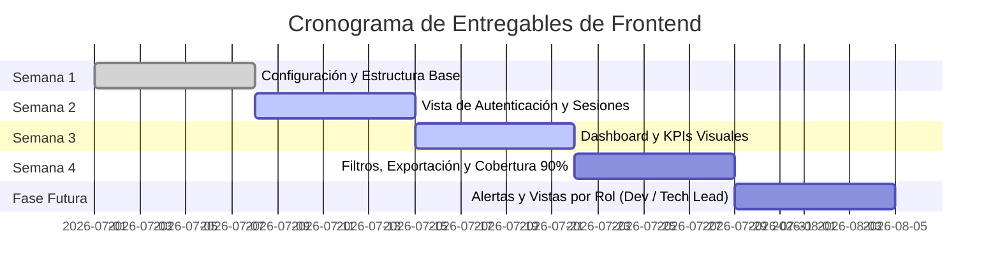

# Plan de Trabajo y Registro de Avances — Frontend SPA

Este documento contiene la planificación semanal de entregables para el **Frontend** del sistema **MCHAV Analytics**, permitiendo registrar y hacer seguimiento a los avances realizados y a las tareas pendientes para la entrega del mes.

---

## 📊 Resumen General del Estado del Frontend

| Semana | Nombre del Bloque | Estado Actual | Porcentaje |
| :---: | :--- | :---: | :---: |
| **Semana 1** | Configuración y Estructura del Frontend | 🟢 Completado | **90%** |
| **Semana 2** | Vista de Autenticación y Rutas Protegidas | 🟢 Completado | **100%** |
| **Semana 3** | Dashboard y Visualización de Métricas (KPIs) | 🟡 En Progreso | **75%** |
| **Semana 4** | Filtros, Exportación de Datos y Suite de Pruebas | 🟠 Por Consolidar | **40%** |
| **Fase Futura** | Sistema de Alertas & Vistas Específicas por Rol | ⏳ Planificado | **0%** |

---

## 🗓️ Detalle de Actividades por Semana

### 🔹 SEMANA 1: Configuración y Estructura del Frontend
> **Objetivo:** Garantizar la base del proyecto React, dependencias, enrutamiento base y diseño modular.

- [x] **Configurar proyecto:** React 19 + Vite + Tailwind CSS v4 + PostCSS en `Mchav-Analytics-Frontend`.
- [x] **Establecer estructura de carpetas:** Organización en `src/components/`, `src/views/`, `src/services/` y `src/assets/`.
- [x] **Configurar routing y navegación:** `react-router-dom` v7 integrado en `App.jsx`.
- [x] **Instalar librerías clave:** `recharts` (gráficas), `lucide-react` (iconografía), `axios` (peticiones HTTP).
- [x] **Crear layout base y componentes reutilizables:**
  - Layout principal (`MainLayout.jsx`)
  - Barra lateral (`Sidebar.jsx`)
  - Barra superior (`Topbar.jsx`)
  - Componente de isotipo/logotipo (`Logo.jsx`)

---

### 🔹 SEMANA 2: Vista de Autenticación
> **Objetivo:** Implementar la interfaz de acceso, la integración con el backend para la sesión y el control de rutas.

- [x] **Diseñar formularios de login/registro:** `LoginView.jsx` con diseño dark-mode y botón de autenticación Jira.
- [x] **Conectar con endpoints de autenticación del backend:**
  - Redirección OAuth con Atlassian (`authService.getLoginUrl()`)
  - Consulta de usuario actual (`authService.getCurrentUser()`)
  - Gestión de credenciales Jira (`getJiraCredentials()`, `saveJiraCredentials()`)
- [x] **Manejar cookies y sesiones:** Peticiones seguras con `axios.defaults.withCredentials = true`.
- [x] **Implementar validación de formularios:** Mensajes de error visuales y manejo de campos en `LoginView.jsx`.
- [x] **Implementar rutas protegidas (`<ProtectedRoute />`):** Bloqueo de ruta `/dashboard` y redirección automática a `/` sin sesión activa.
- [x] **Configurar Modo de Datos Simulados (Mock Data):** Interruptor `USE_MOCK_DATA = true` en `api.js` para desarrollo independiente.

---

### 🔹 SEMANA 3: Dashboard y Visualización de Métricas
> **Objetivo:** Mostrar los indicadores de rendimiento (KPIs), gráficas interactivas y tablas detalladas.

- [x] **Crear componentes para gráficas:**
  - Gráficas de líneas y barras (`Lead Time`, `Cycle Time`, `Velocity`, `Throughput`).
  - Gráfica circular/pie para distribución de bugs y tickets por prioridad.
- [x] **Mostrar métricas clave:** Tarjetas numéricas con KPIs principales (*Active Projects*, *Completed Tickets*, *Critical Bugs*).
- [x] **Conectar con endpoints de KPIs:** Servicio `projectService.getKpis(projectId, sprintId)` integrado.
- [x] **Estados de carga y errores:** Estados `metricsLoading` y `metricsError` para evitar inconsistencias visuales.
- [ ] **Implementar tablas de datos con ordenamiento:** Añadir ordenamiento dinámico por columnas (Lead Time, Fecha, Estado) en la tabla de tickets/sprints.
- [ ] **Refinar Tooltips y Leyendas:** Mejorar el detalle flotante al pasar el cursor sobre las gráficas de `Recharts`.

---

### 🔹 SEMANA 4: Filtros y Pruebas
> **Objetivo:** Filtros avanzados por fechas/proyectos, exportación de información y cobertura de pruebas unitarias al 90%.

- [x] **Selector de Proyectos:** Componente `ProjectPickerDropdown.jsx`.
- [x] **Selector de Fechas:** Componente `DatePickerDropdown.jsx` (Últimos 7 días, 30 días, personalizado).
- [ ] **Implementar filtros combinados:** Conectar simultáneamente fecha, proyecto y equipo en las consultas a la API del backend.
- [ ] **Búsqueda rápida y exportación de datos:**
  - Campo de filtro de texto para búsqueda instantánea en tablas.
  - Botón de exportación a CSV/Excel de la lista de métricas.
- [ ] **Escribir pruebas unitarias de componentes (Objetivo: 90% cobertura):**
  - Configurar `Vitest` + `@testing-library/react`.
  - Crear suites de prueba para `LoginView`, `Sidebar`, `MainLayout` y `DashboardView`.
- [ ] **Pruebas de usabilidad y Responsive Design:** Validar comportamiento fluido en pantallas pequeñas, tablets y monitores.
- [ ] **Optimización de rendimiento:** Reducir re-renders mediante `useMemo` y `useCallback`.

---

### 🚀 FASE FUTURA: Sistema de Alertas y Vistas por Rol (RBAC)
> **Objetivo:** Extender la plataforma con notificaciones inteligentes y vistas personalizadas según el rol del usuario.

- [ ] **🔔 Sistema de Alertas y Notificaciones (Toast / Modales):**
  - Alertas visuales automáticas cuando un KPI supere un umbral crítico (ej. *Lead Time > 5 días* o *Bugs críticos > 3*).
  - Componente de centro de notificaciones en el `Topbar`.
- [ ] **👨‍💻 Vista Desarrollador (`DeveloperView.jsx`):**
  - Panel personalizado con mis tickets asignados, mi *Cycle Time* individual y estado de bloqueos.
  - Acceso directo a tareas pendientes en el sprint activo.
- [ ] **👨‍💼 Vista Líder Técnico (`TechLeadView.jsx`):**
  - Visualización de balance de carga de trabajo por desarrollador del equipo.
  - Tasa de re-trabajo (*re-opened bugs*), velocidad comparativa por sprint y cuellos de botella en Code Review.

---

## 📝 Bitácora de Avances y Seguimiento

| Fecha | Tarea Realizada | Módulo Afectado | Autor / Responsable |
| :---: | :--- | :--- | :--- |
| `2026-07-24` | Creación inicial del proyecto Vite y componentes base de UI | Frontend Base | Equipo |
| `2026-07-27` | Elaboración del Plan de Trabajo para la entrega mensual | Documentación | Usuario + Antigravity |
| `2026-07-27` | Inclusión en el plan de Alertas y Vistas para Desarrollador / Líder Técnico | Documentación | Usuario + Antigravity |

---

## 📌 Ubicación de Archivos Clave del Frontend

- **Vista Login:** [`src/views/auth/LoginView.jsx`](file:///c:/Users/vhoyos/Desktop/Prueba2/Mchav-Analytics-Frontend/src/views/auth/LoginView.jsx)
- **Dashboard Principal:** [`src/views/common/DashboardView.jsx`](file:///c:/Users/vhoyos/Desktop/Prueba2/Mchav-Analytics-Frontend/src/views/common/DashboardView.jsx)
- **Gestión de Usuarios:** [`src/views/admin/UserManagementTab.tsx`](file:///c:/Users/vhoyos/Desktop/Prueba2/Mchav-Analytics-Frontend/src/views/admin/UserManagementTab.tsx)
- **Sincronización:** [`src/views/admin/SystemSyncTab.tsx`](file:///c:/Users/vhoyos/Desktop/Prueba2/Mchav-Analytics-Frontend/src/views/admin/SystemSyncTab.tsx)
- **Servicios API:** [`src/services/api.js`](file:///c:/Users/vhoyos/Desktop/Prueba2/Mchav-Analytics-Frontend/src/services/api.js)
